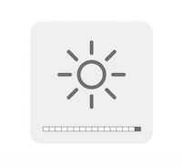

# MonitorControl

Control your external monitor brightness, contrast or volume directly from a menulet or with keyboard shortcuts :

- Brightness: `⇧` + `⌃` + `⌥` + `⌘` + `↑/↓` (Shift + Control + Alt + Command + Up/Down arrows)
- Volume: `⇧` + `⌃` + `⌥` + `⌘` + `←/→` (Shift + Control + Alt + Command + Left/Right arrows)
- Mute: `⇧` + `⌃` + `⌥` + `⌘` + `-` (Shift + Control + Alt + Command + Minus)

(Ps. The keyboard shortcut only work for the default screen)


## Download

Go to [Release](https://github.com/the0neyouseek/MonitorControl/releases/latest) and download the latest `.dmg`

## Brightness/Volume default key
You can use [Karabiner Elements](https://github.com/tekezo/Karabiner-Elements/) to use the default mac key (`F1`, `F2` for brightness and `F10`, `F11`, `F12` for volume) with this set of custom rules :
[Karabiner rules for MonitorControl](./.github/rules.json)

Copy and paste this url in your browser to install them directly :

```
karabiner://karabiner/assets/complex_modifications/import?url=https%3A%2F%2Fraw.githubusercontent.com%2Fthe0neyouseek%2FMonitorControl%2Fmaster%2F.github%2Frules.json
```

---

Bonus: Using keyboard shortcuts display the native osd :



## TODO

- [ ] Hande multiple screen for keyboard shortcut (Possibly the choice to have all screen brightness/volume increase/decrease at the same time or separatly) 
- [ ] Skip Karabiner use for keyboard shortcut
- [ ] Option to start app at login
- [ ] Add [SwiftLint](https://github.com/realm/SwiftLint)
- [ ] Change App Icon

## Support
- macOS Sierra (`10.12`) and up.
- Works with monitors comptaible with [@kfix/ddcctl](https://github.com/kfix/ddcctl)

## Thanks
- [@bluejamesbond](https://github.com/bluejamesbond/) (Original developer)
- [@Tyilo](https://github.com/Tyilo/) (Fork)
- [@Bensge](https://github.com/Bensge/) - (Used some code from his project [NativeDisplayBrightness](https://github.com/Bensge/NativeDisplayBrightness))