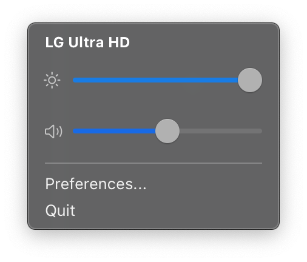
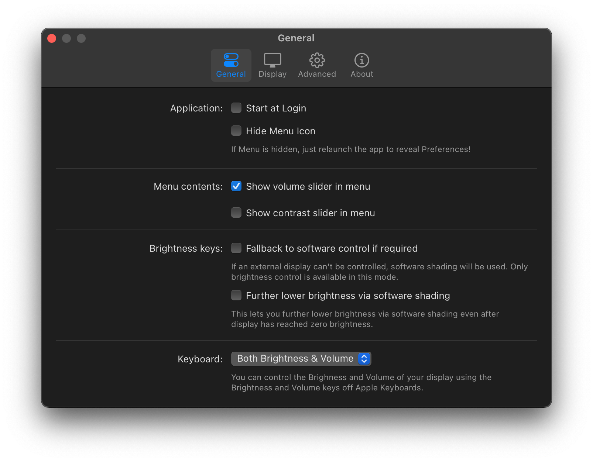
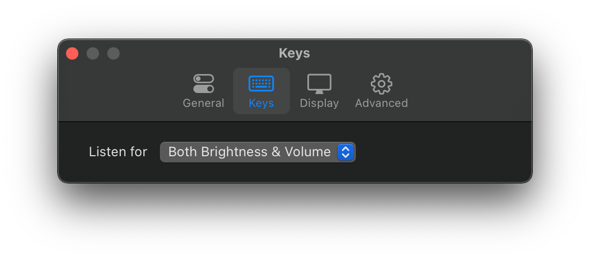
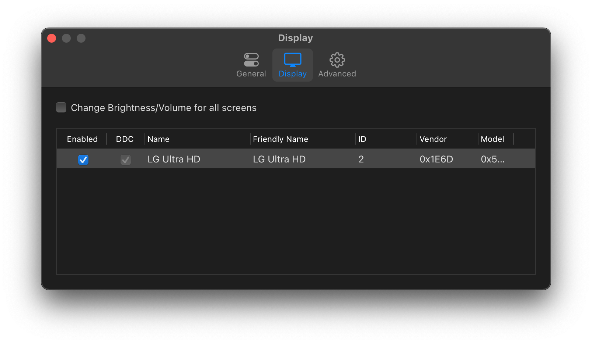
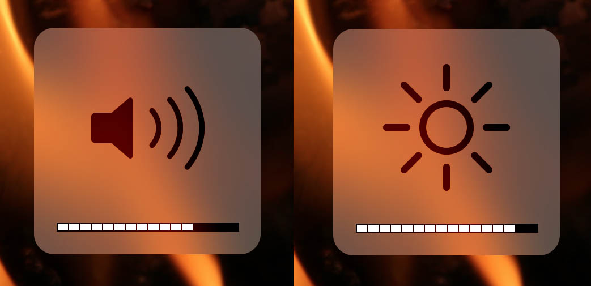

<h1 align="center"> MonitorControl </h1>

<!-- subtext -->
<div align="center">
Control your external monitor brightness, contrast or volume directly from a menulet or with keyboard native keys.
</div>

<br/>

<!-- Language emoji -->
<div align="center">
    <p>Translations: :uk: :fr: :de: :it: :ru: 🇺🇦 :tr: </p>
</div>

<br/>

<!-- shields -->
<div align="center">
    <!-- downloads -->
    <a href="https://github.com/the0neyouseek/MonitorControl/releases">
        
    </a>
    <!-- version -->
    <a href="https://github.com/the0neyouseek/MonitorControl/releases/latest">
        
    </a>
    <!-- license -->
    <a href="https://github.com/the0neyouseek/MonitorControl/blob/master/License.txt">
        
    </a>
    <!-- platform -->
    <a href="https://github.com/the0neyouseek/MonitorControl">
        
    </a>
</div>

<br/>

<div align="center">
    
    <br/><br/>
    

<br/>

_Bonus: Using keyboard keys displays the native osd_


</div>

## Download

Go to [Release](https://github.com/the0neyouseek/MonitorControl/releases/latest) and download the latest `.dmg`

## Installing with Homebrew Cask

You can also install MonitorControl with [Homebrew Cask](https://github.com/Homebrew/homebrew-cask).

```bash
$ brew cask install monitorcontrol
```

## How to help

Open [issues](https://github.com/the0neyouseek/MonitorControl/issues) if you have a question, an enhancement to suggest or a bug you've found. If you want you can fork the code yourself and submit a pull request to improve the app.

## How to build

### Required

- Xcode
- [Carthage](https://github.com/Carthage/Carthage)
- [Swiftlint](https://github.com/realm/SwiftLint)
- [SwiftFormat](https://github.com/nicklockwood/SwiftFormat)

Clone the project

```sh
$ git clone https://github.com/the0neyouseek/MonitorControl.git
```

Then download the dependencies with Carthage

```sh
$ carthage bootstrap --platform macOS
```

You're all set ! Now open the `MonitorControl.xcodeproj` with Xcode

### Third party dependencies

- [MediaKeyTap](https://github.com/the0neyouseek/MediaKeyTap)
- [MASPreferences](https://github.com/shpakovski/MASPreferences)
- [DDC.swift](https://github.com/reitermarkus/DDC.swift)
- [AMCoreAudio](https://github.com/rnine/AMCoreAudio)

## Support

- macOS Sierra (`10.12`) and up.
- Works with monitors controllable via [DDC](https://en.wikipedia.org/wiki/Display_Data_Channel).

## Contributors

- [@the0neyouseek](https://github.com/the0neyouseek)
- [@reitermarkus](https://github.com/reitermarkus)
- [@JoniVR](https://github.com/JoniVR)

## Thanks

- [@bluejamesbond](https://github.com/bluejamesbond/) (Original developer)
- [@Tyilo](https://github.com/Tyilo/) (Fork)
- [@Bensge](https://github.com/Bensge/) - (Used some code from his project [NativeDisplayBrightness](https://github.com/Bensge/NativeDisplayBrightness))
- [@nhurden](https://github.com/nhurden/) (For the original MediaKeyTap)
- [@kfix](https://github.com/kfix/ddcctl) (For ddcctl)
