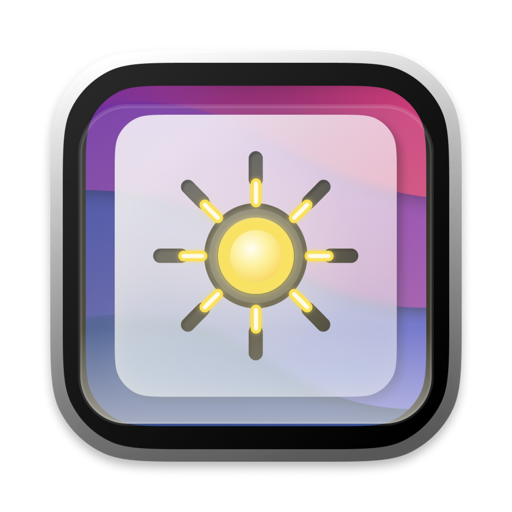
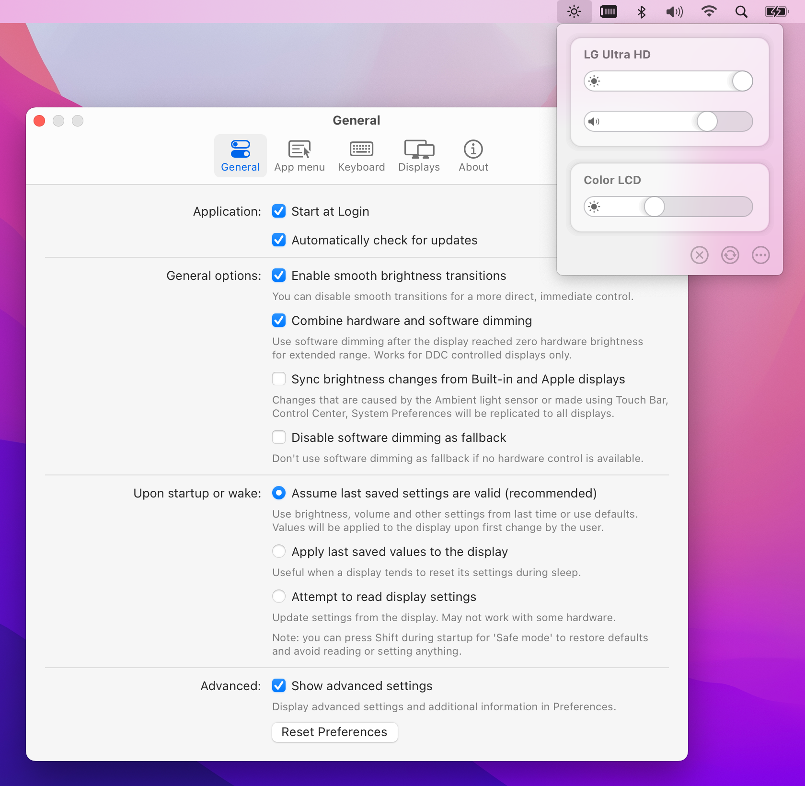

<div>
<h3>XDRMonitorControl</h3>
<p>A fork of <a href="https://github.com/MonitorControl/MonitorControl">MonitorControl</a> by <a href="https://github.com/shay2000">@shay2000</a> with XDR extended brightness support for MacBook Pro Liquid Retina XDR and Pro Display XDR.</p>
</div>

<br/><br/>

<div align="center">
<a href="https://github.com/MonitorControl/MonitorControl/blob/master/License.txt"></a>
<a href="https://github.com/MonitorControl/MonitorControl"></a>


<br/>
<br/>

<br/>

</div>

<hr>

> [!NOTE]
> **XDRMonitorControl** is a personal fork of MonitorControl, maintained by [@shay2000](https://github.com/shay2000). It is not affiliated with or endorsed by the original MonitorControl project. For the official app, see [MonitorControl](https://github.com/MonitorControl/MonitorControl).

> [!WARNING]
> This fork adds XDR extended brightness control, which drives your display above its standard maximum brightness. This may increase heat output and reduce battery life. Use responsibly.

## What's different in this fork

- **XDR Extended Brightness** — Unlocks brightness above the standard system maximum (100%) on MacBook Pro Liquid Retina XDR and Pro Display XDR displays. A red zone appears on the slider when in the extended range. Enable via an opt-in warning dialog the first time you reach maximum brightness.
- **XDR Safety Controls** — "Reset to Standard Brightness" and "Disable XDR Extended Brightness" menu items let you quickly return to normal range.
- **Brightness sync respects XDR range** — When syncing brightness across displays, the target display's maximum (including XDR) is respected.

## Original MonitorControl features

- Control your display's brightness, volume and contrast!
- Shows native OSD for brightness and volume.
- Supports multiple protocols to adjust brightness: DDC for external displays (brightness, contrast, volume), native Apple protocol for Apple and built-in displays, Gamma table control for software dimming, shade control for AirPlay, Sidecar and Display Link devices and other virtual screens.
- Supports smooth brightness transitions.
- Seamlessly combined hardware and software dimming extends dimming beyond the minimum brightness available on your display.
- Synchronize brightness from built-in and Apple screens - replicate Ambient light sensor and touch bar induced changes to a non-Apple external display!
- Sync up all your displays using a single slider or keyboard shortcuts.
- Allows dimming to full black.
- Support for custom keyboard shortcuts as well as standard brightness and media keys on Apple keyboards.
- Dozens of customization options.
- Simple, unobtrusive UI.

## How to build

### Required

- Xcode
- [Swiftlint](https://github.com/realm/SwiftLint)
- [SwiftFormat](https://github.com/nicklockwood/SwiftFormat)

### Build steps

```sh
git clone https://github.com/shay2000/XDRMonitorControl.git
```

Open `MonitorControl.xcodeproj` with Xcode. Dependencies download automatically on first open. If they don't: `File > Packages > Resolve Package Versions`.

### Third party dependencies

- [MediaKeyTap](https://github.com/MonitorControl/MediaKeyTap)
- [Settings](https://github.com/sindresorhus/Settings)
- [SimplyCoreAudio](https://github.com/rnine/SimplyCoreAudio)
- [KeyboardShortcuts](https://github.com/sindresorhus/KeyboardShortcuts)
- [Sparkle](https://github.com/sparkle-project/Sparkle)

## Credits

This project is a fork of [MonitorControl](https://github.com/MonitorControl/MonitorControl). All credit for the original application goes to:

- [@waydabber](https://github.com/waydabber) — maintainer, developer of [BetterDisplay](https://github.com/waydabber/BetterDisplay#readme)
- [@the0neyouseek](https://github.com/the0neyouseek) — honorary maintainer
- [@JoniVR](https://github.com/JoniVR) — honorary maintainer
- [@alin23](https://github.com/alin23) — spearheaded M1 DDC support, developer of [Lunar](https://lunar.fyi)
- [@mathew-kurian](https://github.com/mathew-kurian/) — original developer
- [@Tyilo](https://github.com/Tyilo/) — fork
- [@Bensge](https://github.com/Bensge/) — used code from [NativeDisplayBrightness](https://github.com/Bensge/NativeDisplayBrightness)
- [@nhurden](https://github.com/nhurden/) — original MediaKeyTap
- [@kfix](https://github.com/kfix/ddcctl) — ddcctl
- [@reitermarkus](https://github.com/reitermarkus) — Intel DDC support
- [javierocasio](https://www.deviantart.com/javierocasio) — app icon background

XDR extended brightness additions by [@shay2000](https://github.com/shay2000).

## License

MIT — see [License.txt](License.txt). Original copyright © MonitorControl contributors. Fork additions copyright © 2026 Shay Prasad.
