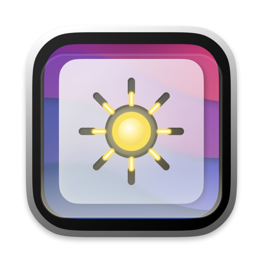
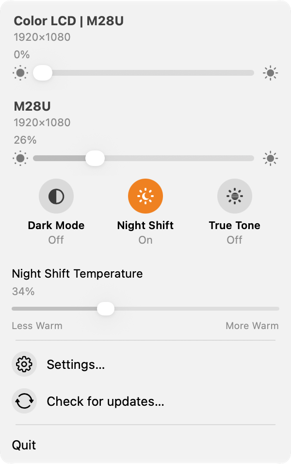
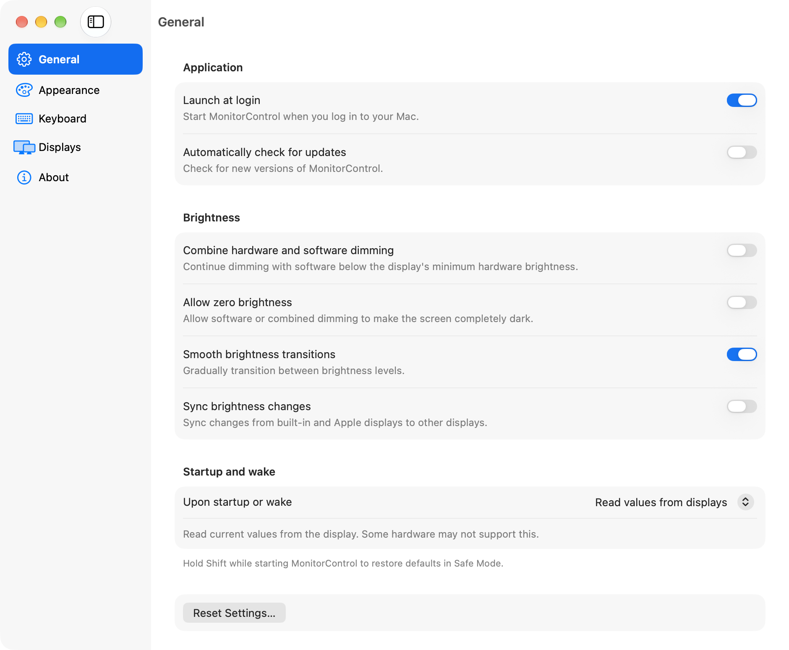

<div align="center">



# MonitorControl

**Your displays, one menu away.**

Control brightness, volume and contrast from the macOS menu bar or your keyboard.

[](https://github.com/MonitorControl/MonitorControl/releases/latest)
[](#macos-compatibility)
[](#how-to-build)
[](License.txt)

**[Download upstream app](https://github.com/MonitorControl/MonitorControl/releases/latest)** · **[Quick start](#quick-start)** · **[Build this fork](#how-to-build)**

[Documentation](#documentation) · [Upstream releases](https://github.com/MonitorControl/MonitorControl/releases) · [Issues](https://github.com/Anywhere-Music-Player/MonitorControl/issues)

</div>

MonitorControl is a free, open-source macOS menu bar app for managing built-in and external displays. It combines hardware controls with software dimming and supports both menu sliders and keyboard shortcuts.

This is the [Anywhere Music Player fork](https://github.com/Anywhere-Music-Player/MonitorControl), on the `dev/modernize-monitorcontrol` branch. It adds a modern settings window and system appearance controls. The screenshots below show this branch. **The fork does not currently publish its own releases:** the download links and Homebrew command install the upstream app, which may differ from this version.

<p align="center">
  
</p>

## Quick start

### Install the upstream app

Download the latest `.dmg` from [upstream releases](https://github.com/MonitorControl/MonitorControl/releases/latest), open it and drag MonitorControl to Applications. Or install using [Homebrew](https://formulae.brew.sh/cask/monitorcontrol):

```sh
brew install --cask monitorcontrol
```

To use the interface and changes shown in this README, [build this fork from source](#how-to-build) on macOS 14 or later.

### Use

1. Open MonitorControl from Applications and click its brightness icon in the menu bar.
2. Move a display's brightness slider, or use your keyboard brightness keys.
3. Open **Settings…** to customize keyboard shortcuts and per-display controls.

Native Apple brightness and media keys require **Accessibility** permission in **System Settings → Privacy & Security → Accessibility**. You can skip this permission if you only use the menu sliders. Hardware brightness, volume and contrast depend on your display and connection; see [Supported displays](#supported-displays).

## Major features

| Area | Controls |
| --- | --- |
| Brightness | Hardware backlight control, smooth transitions, software dimming and combined dimming below the hardware minimum. |
| Audio & contrast | Volume and contrast on monitors that expose these controls through DDC/CI. |
| Multiple displays | Per-display sliders, synchronized brightness and keyboard shortcuts. |
| System appearance | Dark Mode, Night Shift, True Tone and Night Shift temperature controls in this fork. |
| Settings | Resizable sidebar window, display information, launch at login and advanced hardware options. |

<details>
<summary>Full feature list</summary>

- Control your display's brightness, volume and contrast!
- Shows native OSD for brightness and volume.
- Supports multiple protocols to adjust brightness: DDC for external displays (brightness, contrast, volume), native Apple protocol for Apple and built-in displays, Gamma table control for software dimming, shade control for AirPlay, Sidecar and Display Link devices and other virtual screens.
- Supports smooth brightness transitions.
- Seamlessly combined hardware and software dimming extends dimming beyond the minimum brightness available on your display.
- Synchronize brightness from built-in and Apple screens - replicate Ambient light sensor and touch bar induced changes to a non-Apple external display!
- Sync up all your displays using a single slider or keyboard shortcuts.
- Allows dimming to full black.
- Support for custom keyboard shortcuts as well as standard brightness and media keys on Apple keyboards.
- Dozens of customization options to tweak the inner workings of the app to suit your hardware and needs (don't forget to enable `Show advanced settings` in app Settings).
- Simple, unobtrusive UI to blend in to the general aesthetics of macOS.
- Resizable settings window with sidebar navigation and grouped General and Appearance controls.
- Native menu sliders with optional current display resolution labels.
- Launch at login directly through macOS Service Management, without a separate helper app.
- System Dark Mode, Night Shift and True Tone share one option in Settings > Appearance. Night Shift temperature has a separate option. Both are enabled by default. Show percentages also controls the Night Shift temperature value.
- Completely FREE.

</details>

For additional features, more advanced brightness control with XDR/HDR brightness upscaling and support for more Mac models and displays, check out [BetterDisplay](https://github.com/waydabber/BetterDisplay#readme)!

### Settings

<div align="center">

</div>

Use the sidebar to switch between General, Appearance, Keyboard, Displays and About.
General includes launch at login, updates and brightness behavior. Appearance controls
which sliders, display information and system controls appear in the menu. Keyboard
and Displays retain the existing shortcuts and per-display options, including advanced
DDC settings.

## How to install and use the app

1. [Download the app](https://github.com/MonitorControl/MonitorControl/releases)
2. Copy the MonitorControl app file from the .dmg file to your Applications folder
3. Click on the `MonitorControl` app
4. Add the app to `Accessibility` under `System Settings` » `Privacy & Security` as prompted (this is required only if you wish to use the native Apple keyboard brightness and media keys - if this is not the case, you can safely skip this step).
5. Use your keyboard or the sliders in the app menu (a brightness symbol in the macOS menubar as shown on the screenshot above) to control your displays.
6. Open `Settings…` for customization options (enable `Show advanced settings` for even more options).
7. You can set up custom keyboard shortcuts under the `Keyboard` in Settings (the app uses Apple media keys by default).
8. If you have any questions, go to [Discussions](https://github.com/MonitorControl/MonitorControl/discussions)!

### macOS compatibility

This fork’s `dev/modernize-monitorcontrol` branch targets macOS 14 or later. The version in its committed project is 26.0.0; this is not a published fork release. For upstream compatibility and downloads, consult the [upstream release notes](https://github.com/MonitorControl/MonitorControl/releases). Earlier upstream releases remain available for older macOS versions.

| MonitorControl version | macOS version     |
| ---------------------- | ----------------- |
| v4.0.0                 | Catalina 10.15*   |
| v3.1.1                 | Mojave 10.14      |
| v2.1.0                 | Sierra 10.12      |

_* With some limitations - full functionality available on macOS 11 Big Sur or newer._

For upstream macOS 27 Golden Gate compatibility [v4.4.0 or newer](https://github.com/MonitorControl/MonitorControl/releases) is required!

Please note that current versions have limited native macOS OSD support on macOS Tahoe - although the Control Center brightness or volume OSD appears, the OSD percentage value will not show or update.

### Supported displays

- Most modern LCD displays from all major manufacturers supported implemented DDC/CI protocol via USB-C, DisplayPort, HDMI, DVI or VGA to allow for hardware backlight and volume control.
- Apple displays and built-in displays are supported using native protocols.
- LCD and LED Televisions usually do not implement DDC, these are supported using software alternatives to dim the image.
- DisplayLink, Airplay, Sidecar and other virtual screens are supported via shade (overlay) control.

Notable exceptions for hardware control compatibility:

- DDC control using the built-in HDMI port of the 2018 Intel Mac mini, the built-in HDMI port of all M1 Macs (MacBook Pro 14" and 16", Mac Mini, Mac Studio) and the built-in HDMI port of the entry level M2 Mac mini are not supported. Use USB-C instead or get [BetterDisplay](https://betterdisplay.pro) for full DDC control over HDMI with these Macs as well for free. Software-only dimming is still available for these connections.
- Some displays (notably EIZO) use MCCS over USB or an entirely custom protocol for control. These displays are supported with software dimming only.
- DisplayLink docks and dongles do not allow for DDC control on Macs, only software dimming is available for these connections.

## Documentation

- [Installation and usage](#how-to-install-and-use-the-app)
- [macOS compatibility](#macos-compatibility) and [supported displays](#supported-displays)
- [Build from source](#how-to-build)
- [Regression test guide](Tests/README.md)
- [Upstream discussions](https://github.com/MonitorControl/MonitorControl/discussions)

## Contributing to the project

For this fork, [report an issue](https://github.com/Anywhere-Music-Player/MonitorControl/issues) or [open a pull request](https://github.com/Anywhere-Music-Player/MonitorControl/pulls) targeting `dev/modernize-monitorcontrol`. Include your macOS version, display model, connection type and reproduction steps when reporting display problems. For the upstream app, use [upstream Issues](https://github.com/MonitorControl/MonitorControl/issues).

- If you want, you can fork the code, make improvements and submit a pull request to improve the app. Accepting a PR is solely in the hands of the maintainer - before making fundamental changes expecting it to be accepted, please consult the maintainer of the project!

## How to build

### Required

- Xcode with a macOS SDK that supports the branch’s macOS 14 deployment target
- [Swiftlint](https://github.com/realm/SwiftLint)
- [SwiftFormat](https://github.com/nicklockwood/SwiftFormat)
- [BartyCrouch](https://github.com/Flinesoft/BartyCrouch) (for updating localizations)

### Build steps

- Clone the project via this Terminal command:

```sh
git clone --single-branch --branch dev/modernize-monitorcontrol https://github.com/Anywhere-Music-Player/MonitorControl.git
cd MonitorControl
open MonitorControl.xcodeproj
```

Xcode resolves the package dependencies when the project opens. If needed, use **File → Packages → Resolve Package Versions**, then select the MonitorControl scheme and build or run it.

### Checks

The fork includes focused regression scripts:

```sh
./Tests/test-night-shift.sh
./Tests/test-settings.sh
./Tests/test-settings-window.sh
```

See [Tests/README.md](Tests/README.md) for requirements and coverage limits. These checks do not establish physical-display compatibility.

### Third party dependencies

- [MediaKeyTap](https://github.com/MonitorControl/MediaKeyTap)
- [Settings](https://github.com/sindresorhus/Settings)
- [SimplyCoreAudio](https://github.com/rnine/SimplyCoreAudio)
- [KeyboardShortcuts](https://github.com/sindresorhus/KeyboardShortcuts)
- [Sparkle](https://github.com/sparkle-project/Sparkle)

## Credits

- [@waydabber](https://github.com/waydabber), maintainer, developer of [BetterDisplay](https://github.com/waydabber/BetterDisplay#readme).
- [@the0neyouseek](https://github.com/the0neyouseek) - honorary maintainer
- [@JoniVR](https://github.com/JoniVR) - honorary maintainer
- [@alin23](https://github.com/alin23) - spearheaded M1 DDC support, developer of [Lunar](https://lunar.fyi)
- [@mathew-kurian](https://github.com/mathew-kurian/) (original developer)
- [@Tyilo](https://github.com/Tyilo/) (fork)
- [@Bensge](https://github.com/Bensge/) - (used some code from his project [NativeDisplayBrightness](https://github.com/Bensge/NativeDisplayBrightness))
- [@nhurden](https://github.com/nhurden/) (for the original MediaKeyTap)
- [@kfix](https://github.com/kfix/ddcctl) (for ddcctl)
- [@reitermarkus](https://github.com/reitermarkus) (for Intel DDC support)
- [javierocasio](https://www.deviantart.com/javierocasio) (app icon background)

## License

MonitorControl is available under the [MIT License](License.txt). UI code derived from Crisp retains its [MIT copyright notice](MonitorControl/UI/Crisp-LICENSE.txt). Third-party dependencies retain their own licenses.
