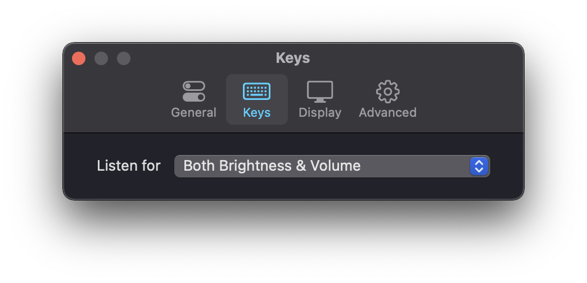

<h1 align="center"> MonitorControl </h1>

<!-- subtext -->
<div align="center">
Control your external monitor brightness, contrast or volume directly from a menulet or with keyboard native keys.
</div>

<br/>

<!-- Language emoji -->
<div align="center">
    <p>Translations: :uk: :fr: :de: :it: :ru: :ukraine: :jp: :poland: :hungary:</p>
</div>

<br/>

<!-- shields -->
<div align="center">
    <!-- downloads -->
    <a href="https://github.com/MonitorControl/MonitorControl/releases">
        
    </a>
    <!-- version -->
    <a href="https://github.com/MonitorControl/MonitorControl/releases">
        
    </a>
    <!-- license -->
    <a href="https://github.com/MonitorControl/MonitorControl/blob/master/License.txt">
        
    </a>
    <!-- platform -->
    <a href="https://github.com/MonitorControl/MonitorControl">
        
    </a>
</div>

<br/>

<div align="center">
    <br/>
    
    
    
    <br/>
    
    

<br/>

_Bonus: Using keyboard keys displays the native osd_

&nbsp;&nbsp;&nbsp;

</div>

## State of the experimental Apple Silicon version

Check out the state of the experimental version [here](https://github.com/MonitorControl/MonitorControl/blob/experimental/apple-silicon/Apple%20Silicon.md).

**Test it at your own risk!**

## How to build this *experimental branch*

### Required

- Xcode
- [Swiftlint](https://github.com/realm/SwiftLint)
- [SwiftFormat](https://github.com/nicklockwood/SwiftFormat)
- [BartyCrouch](https://github.com/Flinesoft/BartyCrouch) (for updating localizations)

Clone the project

```sh
git clone --single-branch --branch experimental/apple-silicon https://github.com/MonitorControl/MonitorControl.git
```

Then dependencies will automatically get downloaded when opening the project, if they don't:

`File > Swift Packages > Resolve Package Versions`

You're all set ! Now open the `MonitorControl.xcodeproj` with Xcode

### Third party dependencies

- [MediaKeyTap](https://github.com/MonitorControl/MediaKeyTap)
- [Preferences](https://github.com/sindresorhus/Preferences)
- [DDC.swift](https://github.com/reitermarkus/DDC.swift)
- [SimplyCoreAudio](https://github.com/rnine/SimplyCoreAudio)

## How to help

Open [issues](https://github.com/MonitorControl/MonitorControl/issues) if you have a question, an enhancement to suggest or a bug you've found. If you want you can fork the code yourself and submit a pull request to improve the app.

## Download the pre-release version

Go to [Releases](https://github.com/MonitorControl/MonitorControl/releases) and download the latest pre-release `.dmg`

## Installing with Homebrew Cask

You can also install MonitorControl with [Homebrew Cask](https://github.com/Homebrew/homebrew-cask). 

**Be aware that this command will not install the experimental Apple Silicon compatible version of the app!**

```bash
brew install --cask monitorcontrol
```

## Support

- macOS Sierra (`10.12`) and up.
- For the Apple Silicon version macOS Big Sur and up 
- Works with monitors controllable via [DDC](https://en.wikipedia.org/wiki/Display_Data_Channel).

## Contributors

- [@the0neyouseek](https://github.com/the0neyouseek)
- [@reitermarkus](https://github.com/reitermarkus)
- [@JoniVR](https://github.com/JoniVR)
- [@waydabber](https://github.com/waydabber)

## Thanks

- [@bluejamesbond](https://github.com/bluejamesbond/) (Original developer)
- [@Tyilo](https://github.com/Tyilo/) (Fork)
- [@Bensge](https://github.com/Bensge/) - (Used some code from his project [NativeDisplayBrightness](https://github.com/Bensge/NativeDisplayBrightness))
- [@nhurden](https://github.com/nhurden/) (For the original MediaKeyTap)
- [@kfix](https://github.com/kfix/ddcctl) (For ddcctl)
- [@tao-j](https://github.com/tao-j) (For originally figuring out M1 DDC)
- [@alin23](https://github.com/alin23) (For contribution in further figuring out M1 DDC)
