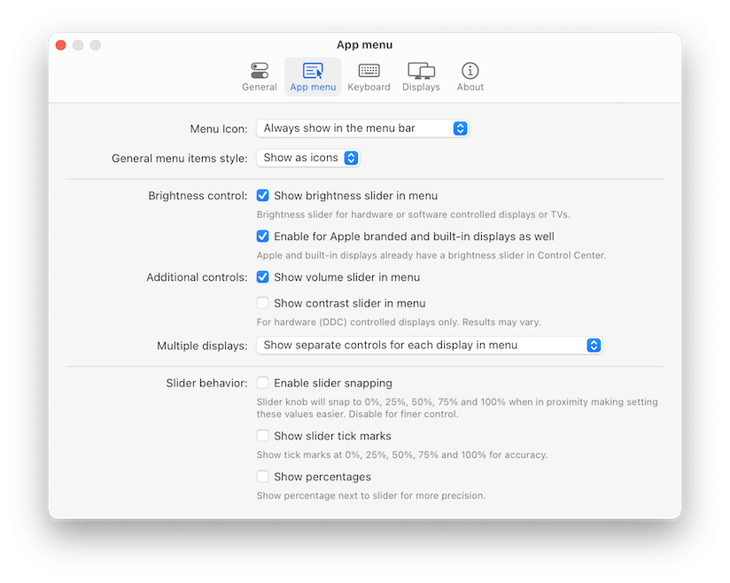
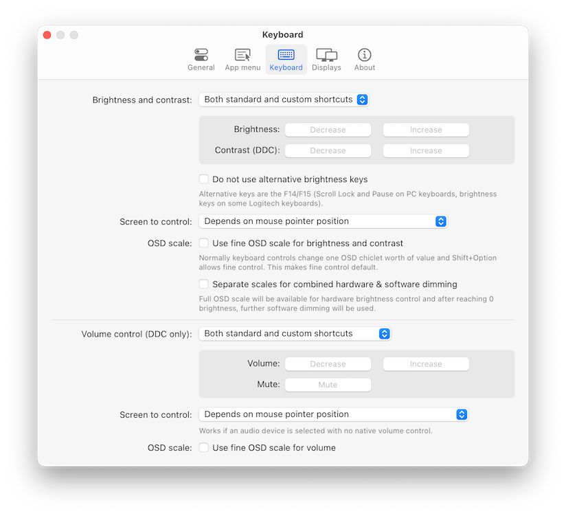
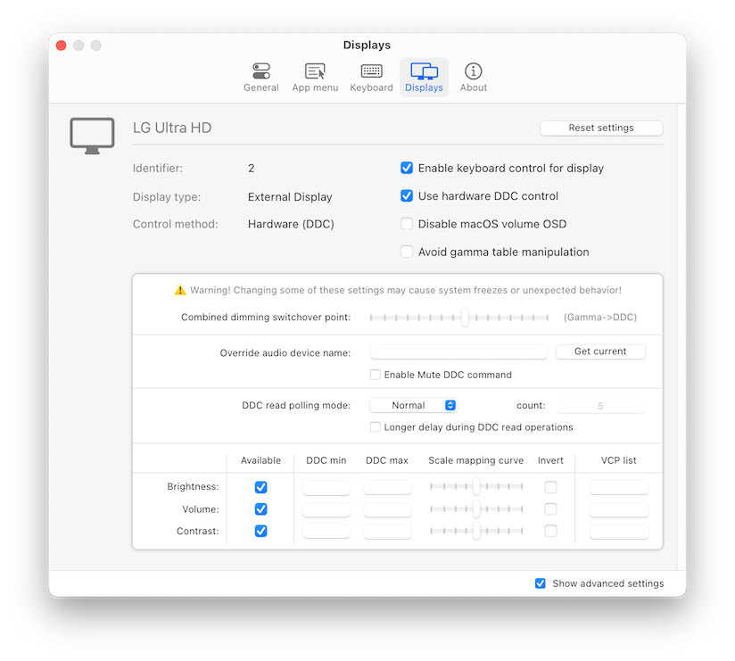

<div>
<h2>MonitorControl - for Apple Silicon and Intel</h2>
<p>Controls your external display brightness and volume and shows native OSD.
Use menulet sliders or the keyboard, including native Apple keys!</p>
<a href="https://github.com/MonitorControl/MonitorControl/releases"></a>
</div>

<br/><br/>

<div align="center">
<!-- shields -->
<!-- downloads -->
<a href="https://github.com/MonitorControl/MonitorControl/releases">

</a>
<!-- version -->
<a href="https://github.com/MonitorControl/MonitorControl/releases">

</a>
<!-- license -->
<a href="https://github.com/MonitorControl/MonitorControl/blob/master/License.txt">

</a>
<!-- platform -->
<a href="https://github.com/MonitorControl/MonitorControl">

</a>
<!-- backers -->
<a href="https://opencollective.com/monitorcontrol">

</a>

<br/>
<br/>

<br/>

</div>

<hr>

## Download

Go to [Releases](https://github.com/MonitorControl/MonitorControl/releases) and download the latest `.dmg`

## Major features

- Control your display's brightness, volume and contrast!
- Shows native OSD for brightness and volume.
- Supports multiple protocols to adjust brightness: DDC for external displays (brightness, contrast, volume), native Apple protocol for Apple and built-in displays, Gamma table control for software adjustment (recommended for OLED), shade control for AirPlay, Sidecar and Display Link devices.
- Supports smooth brightness transitions.
- Seamlessly combined hardware and software dimming extends dimming beyond the minimum brightness available on your display.
- Synchronize brightness from built-in and Apple screens - replicate Ambient light sensor and touch bar induced changes to a non-Apple external display!
- Sync up all your displays using a single slider or keyboard shortcuts.
- Allows dimming to full black (advanced feature).
- Support for custom keyboard shortcuts as well as standard brightness and media keys on Apple keyboards.
- Dozens of customization options to tweak the inner workings of the app to suit your hardware and needs (don't forget to enable `Show advanced settings` in app Preferences).
- Modern, stylish and highly customizable menulet reflecting the design of Control Control introduced in Big Sur.
- Simple, unobstrusive UI to blend in to the general aesthetics of macOS (even the menu icon can be hidden).
- Supports automatic updates for a hassle-free experience.
- <b>The best app of its kind, completely FREE ([donations welcome](https://opencollective.com/monitorcontrol)) with the source code transparently available!</b>

## How to install and use the app

1. [Download the app](https://github.com/MonitorControl/MonitorControl/releases)
2. Copy the MonitorControl app file from the .DMG to your Applications folder
3. Click on the `MonitorControl` app file
4. Add the app to `Accessibility` under `System Preferences` » `Security & Privacy` » `Privacy` as prompted (this is required only if you wish to use the native Apple keyboard brightness and media keys - if this is not the case, you can safely skip this step).
5. Use your keyboard or the sliders in the app menu (a brightness symbol in the macOS menubar as shown on the screenshot above) to control your displays.
6. Open `Preferences...` for customization options (enable `Show advanced settings` for even more options).
7. You can set up custom keyboard shortcuts under the `Keyboard` in Preferences (the app uses Apple media keys by default).
8. If you have any questions, go to [Discussions](https://github.com/MonitorControl/MonitorControl/discussions)!

## Screenshots (Preferences)

<div align="center">




</div>

## macOS compatibility

| MonitorControl version | macOS version     |
| ---------------------- | ----------------- |
| v4.0.0                 | Catalina 10.15*   |
| v3.1.1                 | Mojave 10.14      |
| v2.1.0                 | Sierra 10.12      |

_* With some limitations - full functionality available on macOS 11 Big Sur or newer._

## Supported displays

- Most modern LCD displays from all major manufacturers supported implemented DDC/CI protocol via DisplayPort, HDMI, USB-C or VGA to allow for hardware backlight control.
- Apple (and LG-Apple) displays and built-in displays are supported using native protocol.
- LCD and LED Televisions usually do not implement DDC, these are supported using software alternatives to dim the image (some higher-end sets are able to translate this into hardware backlight dimming).
- OLED or mini/micro-LED displays and televisions are fully supported using gamma table manipulation (this is a no-compromise solution for this class of displays).
- DisplayLink, Airplay and Sidecar are supported using shade (dark overlay) control.
- The app is compatible with [BetterDummy](https://github.com/waydabber/BetterDummy) mirrored sets.

Notable exceptions for hardware control compatibility:

- Some displays (notably EIZO) use MCCS over USB or an entirely custom protocol for control. These displays are supported with software dimming only.
- The HDMI port of the 2018 Intel Mac mini and 2020 M1 Mac mini prohibit DDC communication. Software control is still available. We recommend connecting the display via the USB-C port (USB-C to HDMI dongles usually work).
- DisplayLink docks and dongles do not allow for DDC control on Macs, only software dimming is available for these connections.

Note to f.lux users - please activate `Avoid gamma table manipulation` under `Preferences` » `Displays`! This step is not needed if you use Night Shift.

## How to help

- You can greatly help out [by financing the project with your donation or by being a Sponsor](https://opencollective.com/monitorcontrol)!
- Open [issues](https://github.com/MonitorControl/MonitorControl/issues) if you have a question, an enhancement to suggest or a bug you've found.
- If you want, you can fork the code yourself and submit a pull request to improve the app (Note: accepting a PR is solely in the collective hands of the maintainers).

## Localizations

MonitorControl supports localization. We gladly welcome your contribution with a new language! See the [opening post of the relevant discussion](https://github.com/MonitorControl/MonitorControl/discussions/637) on how to add your translation!

## How to build

### Required

- Xcode
- [Swiftlint](https://github.com/realm/SwiftLint)
- [SwiftFormat](https://github.com/nicklockwood/SwiftFormat)
- [BartyCrouch](https://github.com/Flinesoft/BartyCrouch) (for updating localizations)

### Build steps

- Clone the project via this Terminal command:

```sh
git clone https://github.com/MonitorControl/MonitorControl.git
```

- If you want to clone one of the branches, add `--single-branch --branch [branchname]` after the `clone` option.
- You're all set! Now open the `MonitorControl.xcodeproj` with Xcode! The dependencies will automatically get downloaded once you open the project. If they don't: `File > Packages > Resolve Package Versions`

### Third party dependencies

- [MediaKeyTap](https://github.com/MonitorControl/MediaKeyTap)
- [Preferences](https://github.com/sindresorhus/Preferences)
- [SimplyCoreAudio](https://github.com/rnine/SimplyCoreAudio)
- [KeyboardShortcuts](https://github.com/sindresorhus/KeyboardShortcuts)
- [Sparkle](https://github.com/sparkle-project/Sparkle)

## Maintainers

- [@the0neyouseek](https://github.com/the0neyouseek)
- [@JoniVR](https://github.com/JoniVR)
- [@waydabber](https://github.com/waydabber)

## Thanks

- [@mathew-kurian](https://github.com/mathew-kurian/) (original developer)
- [@Tyilo](https://github.com/Tyilo/) (fork)
- [@Bensge](https://github.com/Bensge/) - (used some code from his project [NativeDisplayBrightness](https://github.com/Bensge/NativeDisplayBrightness))
- [@nhurden](https://github.com/nhurden/) (for the original MediaKeyTap)
- [@kfix](https://github.com/kfix/ddcctl) (for ddcctl)
- [@reitermarkus](https://github.com/reitermarkus) (for Intel DDC support)
- [@alin23](https://github.com/alin23) (generally spearheaded M1 DDC support and figured out a many of the caveats)
- [javierocasio](https://www.deviantart.com/javierocasio) (app icon background)
