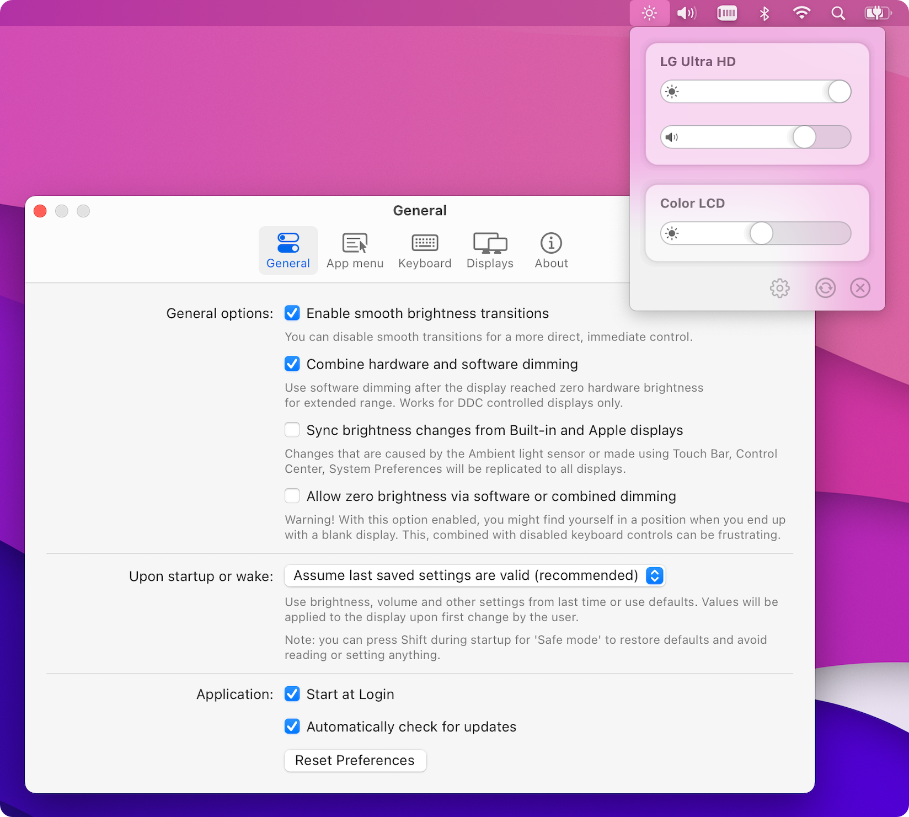

<h2>MonitorControl - Now with Apple Silicon support!</h2>
        
<p>
<b>Control your external display brightness and volume!<br>
Use menulet sliders or the native Apple keyboard keys!<br>
Shows native brightness and volume OSDs as well!</b>
</p>            

<br/>
 
<div align="center">
<!-- shields -->
<!-- downloads -->
<a href="https://github.com/MonitorControl/MonitorControl/releases">

</a>
<!-- version -->
<a href="https://github.com/MonitorControl/MonitorControl/releases">

</a>
<!-- license -->
<a href="https://github.com/MonitorControl/MonitorControl/blob/master/License.txt">

</a>
<!-- platform -->
<a href="https://github.com/MonitorControl/MonitorControl">

</a>
<!-- backers -->
<a href="https://opencollective.com/monitorcontrol">

</a>
    
<br/>
<br/>

</div>

<br/>

<hr>

## Download

Go to [Releases](https://github.com/MonitorControl/MonitorControl/releases) and download the latest `.dmg`

## Compatibility

- macOS Big Sur (`macOS 11`) and newer are supported
- Current version is compatible with macOS Catalina (`10.15`) as well (with some limitations).

_(Note: you can download [version 2.1.0](https://github.com/MonitorControl/MonitorControl/releases/tag/v2.1.0) for Sierra `10.12` and [version 3.1.1](https://github.com/MonitorControl/MonitorControl/releases/tag/v3.1.1) for Mojave `10.14` support)_

## How to help

Open [issues](https://github.com/MonitorControl/MonitorControl/issues) if you have a question, an enhancement to suggest or a bug you've found. If you want you can fork the code yourself and submit a pull request to improve the app.
        
## How to build

### Required

- Xcode
- [Swiftlint](https://github.com/realm/SwiftLint)
- [SwiftFormat](https://github.com/nicklockwood/SwiftFormat)
- [BartyCrouch](https://github.com/Flinesoft/BartyCrouch) (for updating localizations)

Clone the project via this Terminal command:

```
git clone https://github.com/MonitorControl/MonitorControl.git
```

If you want to clone one of the branches, add `--single-branch --branch [branchname]` after the `clone` option.

You're all set ! Now open the `MonitorControl.xcodeproj` with Xcode! The dependencies will automatically get downloaded once you open the project. If they don't:

`File > Packages > Resolve Package Versions`

(In earlier XCode versions `Packages` menu is titled `Swift Packages`)

### Third party dependencies

- [MediaKeyTap](https://github.com/MonitorControl/MediaKeyTap)
- [Preferences](https://github.com/sindresorhus/Preferences)
- [SimplyCoreAudio](https://github.com/rnine/SimplyCoreAudio)
- [KeyboardShortcuts](https://github.com/sindresorhus/KeyboardShortcuts)
- [Sparkle](https://github.com/sparkle-project/Sparkle)

## Contributors

- [@the0neyouseek](https://github.com/the0neyouseek)
- [@JoniVR](https://github.com/JoniVR)
- [@waydabber](https://github.com/waydabber)

## Thanks

- [@bluejamesbond](https://github.com/bluejamesbond/) (original developer)
- [@Tyilo](https://github.com/Tyilo/) (fork)
- [@Bensge](https://github.com/Bensge/) - (used some code from his project [NativeDisplayBrightness](https://github.com/Bensge/NativeDisplayBrightness))
- [@nhurden](https://github.com/nhurden/) (for the original MediaKeyTap)
- [@kfix](https://github.com/kfix/ddcctl) (for ddcctl)
- [@reitermarkus](https://github.com/reitermarkus) (for DDC.Swift)
- [@zhuowei](https://github.com/zhuowei) (figured out M1 I²C communication)
- [@tao-j](https://github.com/tao-j) (figured out M1 I²C write)
- [@alin23](https://github.com/alin23) (generally spearheaded M1 DDC support and figured out a many of the caveats)
- [javierocasio](https://www.deviantart.com/javierocasio) (app icon background)
