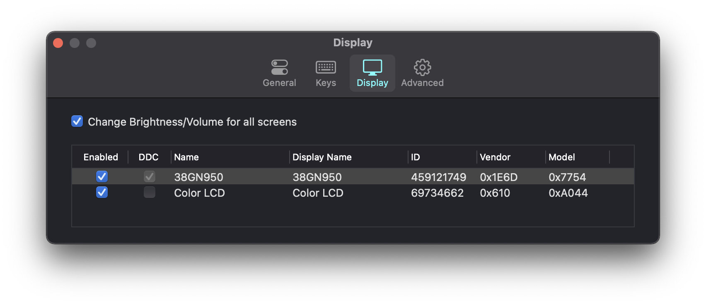

## Experimental

This is an **experimental** fork to have some kind of **M1 support** until DDC.Swift is updated.

Currently brightness and volume control works if you have a *single*, *compatible* external display connected to your *M1 Mac* via *USB-C/DisplayPort* (HDMI does not work).

Sorry, no Release, you have to build it in XCode if you are interested.

Notes: I am not sure about Intel compatibility, but I tried not to break it. I tested only on Monterey but should work on Big Sur as well.

Current state:

- [x] Make the app compile without complaints on ARM, fix the OSD.Framework problem.
- [x] Figure out how to do M1 DDC control in 100% Swift (MonitorControl seems to avoid C :))
- [x] Make it work with a single external display config on M1.
- [x] Make DDC writes work on M1 - results in a fundamentally working app on M1. **MILESTONE ACHIEVED**
- [ ] Make DDC read work on M1 (to set up initial brightness and volume on app start).
- [ ] Proper multi monitor detection (this applies only for the M1 Mac Mini as of now, but its HDMI port does not pass through I2C commands).
- [ ] Fix issue with internal display brightness display control on M1.
- [ ] Add proper guards everywhere and do all the required cleanup to make things tidy.

</div>

<hr>

<h1 align="center"> MonitorControl </h1>

<!-- subtext -->
<div align="center">
Control your external monitor brightness, contrast or volume directly from a menulet or with keyboard native keys.
</div>

<br/>

<!-- Language emoji -->
<div align="center">
    <p>Translations: :uk: :fr: :de: :it: :ru: :ukraine: :jp: :poland: </p>
</div>

<br/>

<!-- shields -->
<div align="center">
    <!-- downloads -->
    <a href="https://github.com/MonitorControl/MonitorControl/releases">
        
    </a>
    <!-- version -->
    <a href="https://github.com/MonitorControl/MonitorControl/releases/latest">
        
    </a>
    <!-- license -->
    <a href="https://github.com/MonitorControl/MonitorControl/blob/master/License.txt">
        
    </a>
    <!-- platform -->
    <a href="https://github.com/MonitorControl/MonitorControl">
        
    </a>
</div>

<br/>

<div align="center">
    
    <br/><br/>
    
    
    

<br/>

_Bonus: Using keyboard keys displays the native osd_


</div>

## Download

Sorry, no releases download for this experimental fork.

## How to help

Open [issues](https://github.com/MonitorControl/MonitorControl/issues) if you have a question, an enhancement to suggest or a bug you've found. If you want you can fork the code yourself and submit a pull request to improve the app.

## How to build

### Required

- Xcode

Clone the project

```sh
git clone https://github.com/MonitorControl/MonitorControl.git
```

Then dependencies will automatically get downloaded when opening the project, if they don't:

`File > Swift Packages > Resolve Package Versions`

You're all set ! Now open the `MonitorControl.xcodeproj` with Xcode

### Third party dependencies

- [MediaKeyTap](https://github.com/MonitorControl/MediaKeyTap)
- [Preferences](https://github.com/sindresorhus/Preferences)
- [DDC.swift](https://github.com/reitermarkus/DDC.swift)
- [SimplyCoreAudio](https://github.com/rnine/SimplyCoreAudio)

## Support

- macOS Big Sur (`11.0`) and up.
- Works with monitors controllable via [DDC](https://en.wikipedia.org/wiki/Display_Data_Channel).

## Contributors

- [@the0neyouseek](https://github.com/the0neyouseek)
- [@reitermarkus](https://github.com/reitermarkus)
- [@JoniVR](https://github.com/JoniVR)

## Thanks

- [@bluejamesbond](https://github.com/bluejamesbond/) (Original developer)
- [@Tyilo](https://github.com/Tyilo/) (Fork)
- [@Bensge](https://github.com/Bensge/) - (Used some code from his project [NativeDisplayBrightness](https://github.com/Bensge/NativeDisplayBrightness))
- [@nhurden](https://github.com/nhurden/) (For the original MediaKeyTap)
- [@kfix](https://github.com/kfix/ddcctl) (For ddcctl)
